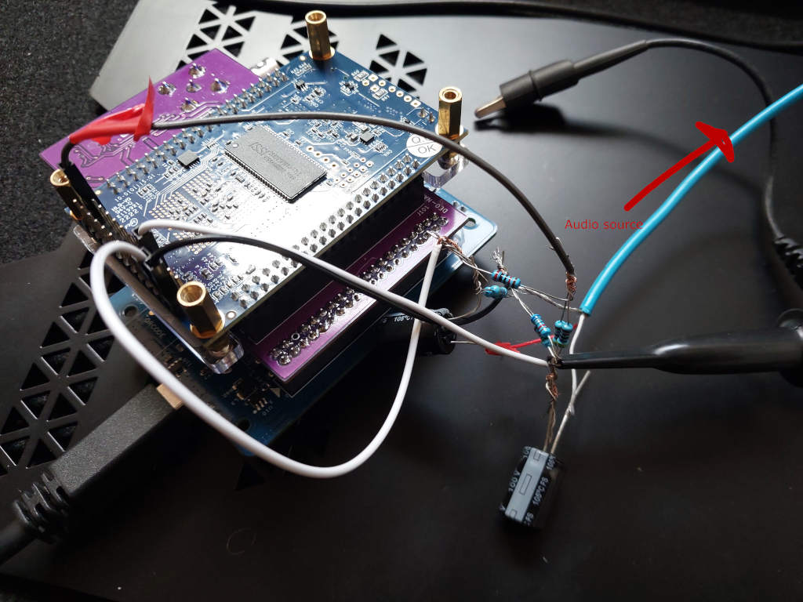

# An experiment to add an audio ADC to the Domesday Duplicator (DdD)

* 78.125khz
* Audio packed into the 6 bits of each RF sample that are currently used for the sequence counter. Plan is to change the sequence counting logic a bit to accomodate both audio and sequence counter.

Note this is very experimental and not ready yet!

First test using the De0-nano integrated ADC. Wiring:

```
                         3v3
	             	      |
	             		  |
					Resistor 20k
                          |
                          |
Audio L -> Capacitor 63uF -> ADC input pin
                          |
                          |
                    Resistor 20k
	             	      |
	             		  |
	             		 GND
```

Or as a photo:



Raw audio sample: https://drive.google.com/file/d/1YDUgs62EAt5DQ-i5lx5EXW8916SzUuaT/view?usp=drivesdk (note: has a lot of DC offset, hiss)

# Domesday Duplicator (DdD)

Please see the [Project Wiki](https://github.com/simoninns/DomesdayDuplicator/wiki) for details of the project and for access to the project documentation.


The Domesday Duplicator is a LaserDisc capture focused, USB 3.0 based DAQ capable of 40 million samples per second acquisition of analogue RF data at 10-bits resolution, the data being in generic PCM style stream format is ready for [FLAC compression](https://github.com/oyvindln/vhs-decode/wiki/RF-Compression-&-Decompression-Guide) or direct use with a wide range of decoders.

Capture is via a easy to use GUI capture application.


# The Decode Family 

The samples the DdD capture can be used with the family of decoders that make the FM RF Archival workflow ready to use today.

[LaserDisc Decode](https://github.com/happycube/ld-decode) / [VHS-Decode (Videotape)](https://github.com/oyvindln/vhs-decode/wiki/) / [CVBS (Composite) Decode](CVBS-Composite-Decode) / [HiFi Decode](HiFi-Decode) / [RTLSDR HiFi Decode](RTLSDR) / [MUSE-Decode](https://bitbucket.org/staffanulfberg/ldaudio/src/master/musecpp/) / [CD-Decode](https://github.com/happycube/cd-decode) / [FL2K TBC Player](TBC-To-Analogue)

# 3D Printed Case 

The DomesDay Duplicator also has a [3D models](https://github.com/simoninns/DomesdayDuplicator-Case) and ready to use data for producing 3D printed cases, to protect from dust or line with copper tape for affordable EMI shielding for example.


## Authors

Domesday Duplicator was written & designed by [Simon Inns](https://github.com/simoninns).

Current documentation & fabrication is maintained by [Harry Munday](https://github.com/harrypm). 


## Licences


- [Software License - (Creative Commons BY-SA 4.0)](https://github.com/simoninns/DomesdayDuplicator/blob/master/LICENSE)
- [Hardware License - (GPLv3)](https://creativecommons.org/licenses/by-sa/4.0/)
