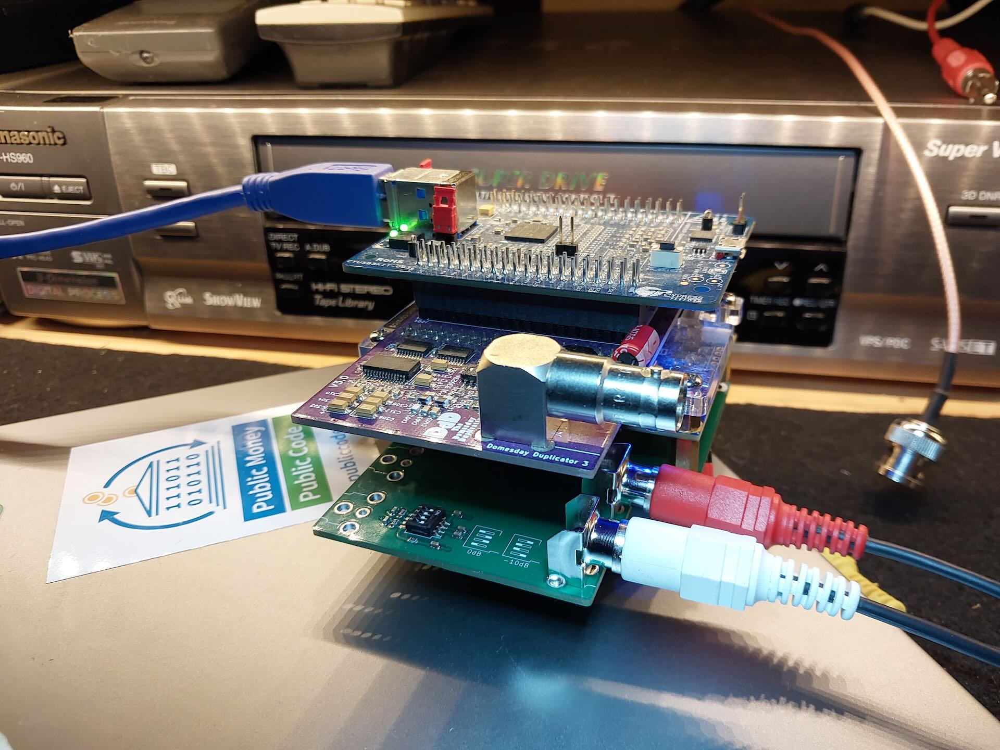
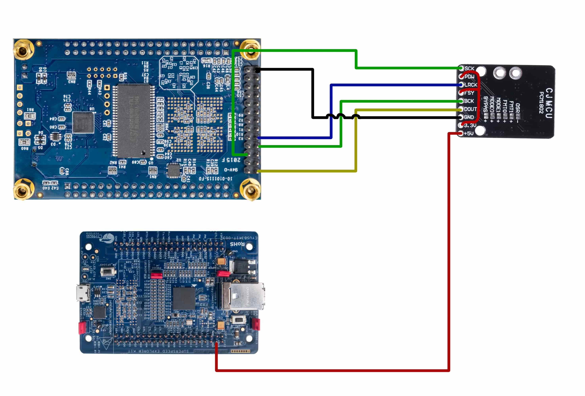
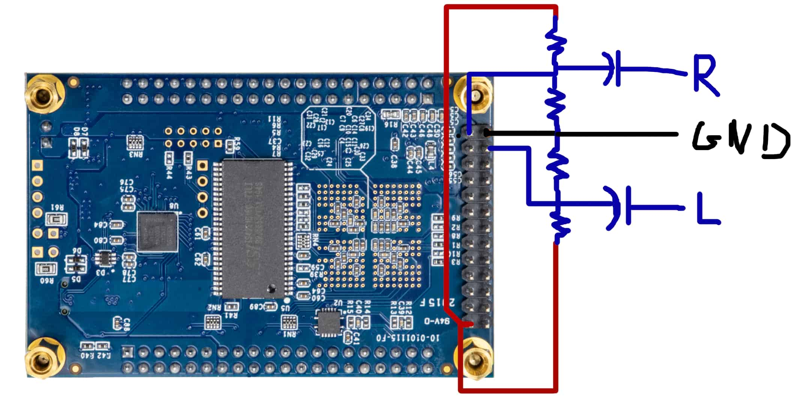

# An experiment to add an audio ADC to the Domesday Duplicator (DdD)

An extension to the DdD to to add synced baseband audio support, with the DdD capture app writing it as a separate WAV file. Both PCM1802 (common module from china or custom board), or using the built-in adc128s102 that is already integrated on the DE0-nano board. PCM1802 has better quality, integrated ADC notably has a high noise floor at -40dB.

## Setup:

### You can use either:

**Custom board**: I designed a custom board, which has RCAs for both the PCM 1802, and the integrated adc128s102, allowing to use 4 channels at the same time if desired. Has better power regulator than PCM1802 modules (maybe lower noise), has a DIP switch for -10dB input level if needed.

This currently has some errors, notably the connectior is flipped so it doesn't fit as intended, and requires one small bodge for the dout output buffer (output enable needs to be low, not high). I have a few spare (pre-bodged and soldered, with RCAs once they arrive), contact @Doohickey in Domesday86 discord, for around €15 + cheap shipping in europe. I'll maybe make a fixed version later.

**PCM1802 module**:

You can also use the low cost PCM1802 module. Connect with jumper wires, diagram:

You don't need to solder any of the fmt/mode/osr/bypass. Make sure the 3.3v on your module is working (3.3v is present), 3.3v needs to be connected to the pdw and fsy pins on the module. Connect lin/rin/gnd on the module to your audio source.

**adc128s102**:

Can be used with just some resistors and capacitors:

Resistors: any value between 1k and 10k works. Capacitor 1-10uF works. All capacitors and resistors need to be the same.

Can be used together with PCM1802 for 4 channels.

## Firmware:

You'll need to flash the firmware of the deo-nano, using the same process as for the initial flash. (firmware file in releases section). Note that there's no backward compatiblity, both the firmware and application need to be from this repository. Firmware from this repository won't work with old application either.

## Application:

Set your audio source in the application settings, then start capturing. It will write a wav file in the same lication as the RF data, and show some statistics for the audio.

# Domesday Duplicator (DdD)

Please see the [Project Wiki](https://github.com/simoninns/DomesdayDuplicator/wiki) for details of the project and for access to the project documentation.

The Domesday Duplicator is a LaserDisc capture focused, USB 3.0 based DAQ capable of 40 million samples per second acquisition of analogue RF data at 10-bits resolution, the data being in generic PCM style stream format is ready for [FLAC compression](https://github.com/oyvindln/vhs-decode/wiki/RF-Compression-&-Decompression-Guide) or direct use with a wide range of decoders.

Capture is via a easy to use GUI capture application.

# The Decode Family 

The samples the DdD capture can be used with the family of decoders that make the FM RF Archival workflow ready to use today.

[LaserDisc Decode](https://github.com/happycube/ld-decode) / [VHS-Decode (Videotape)](https://github.com/oyvindln/vhs-decode/wiki/) / [CVBS (Composite) Decode](CVBS-Composite-Decode) / [HiFi Decode](HiFi-Decode) / [RTLSDR HiFi Decode](RTLSDR) / [MUSE-Decode](https://bitbucket.org/staffanulfberg/ldaudio/src/master/musecpp/) / [CD-Decode](https://github.com/happycube/cd-decode) / [FL2K TBC Player](TBC-To-Analogue)

# 3D Printed Case 

The DomesDay Duplicator also has a [3D models](https://github.com/simoninns/DomesdayDuplicator-Case) and ready to use data for producing 3D printed cases, to protect from dust or line with copper tape for affordable EMI shielding for example.

## Authors

Domesday Duplicator was written & designed by [Simon Inns](https://github.com/simoninns).

Current documentation & fabrication is maintained by [Harry Munday](https://github.com/harrypm). 

## Licences

- [Software License - (Creative Commons BY-SA 4.0)](https://github.com/simoninns/DomesdayDuplicator/blob/master/LICENSE)
- [Hardware License - (GPLv3)](https://creativecommons.org/licenses/by-sa/4.0/)
